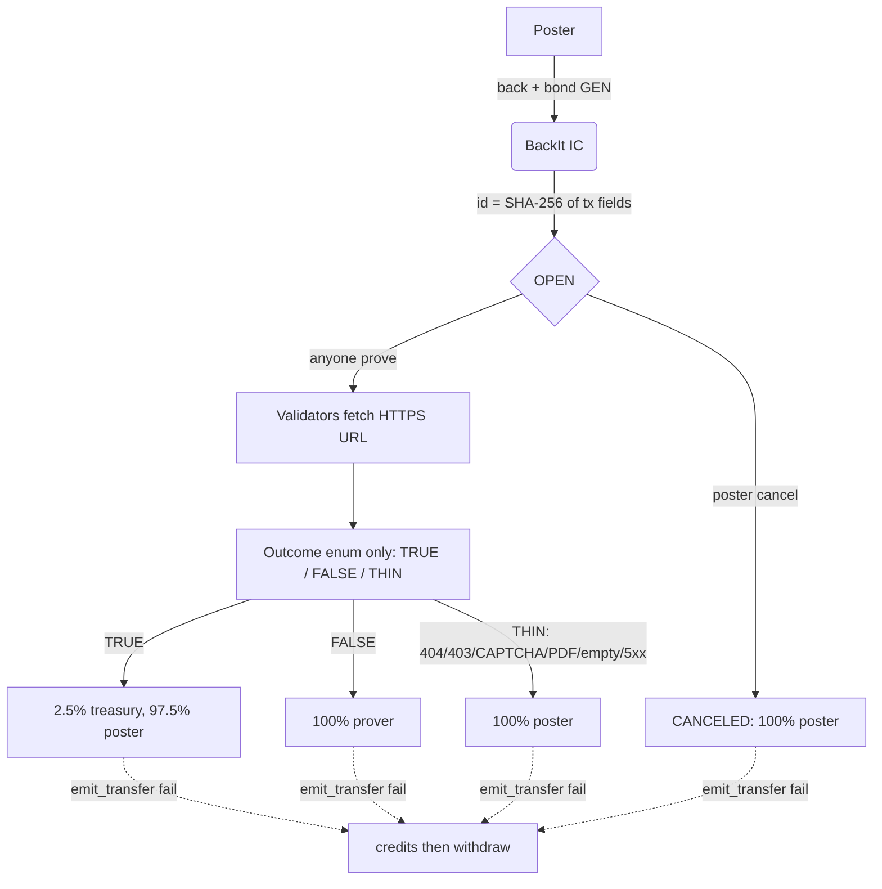

# BackIt

**Same-session live-web primitive on GenLayer StudioNet.**

A poster locks **test GEN** on one sentence and one official HTTPS URL. Anyone calls `prove`. Validators fetch the live page. The Intelligent Contract returns `TRUE | FALSE | THIN` and **moves money in that write**.

Not a court. Not an appeal board. Not a delayed oracle. Not a keeper network. StudioNet only. **No real value.**

### Live

- **StudioNet contract:** [`0xEb3c460DD484fd3A4bF1003FA9C29f25B3c45568`](https://explorer-studio.genlayer.com/address/0xEb3c460DD484fd3A4bF1003FA9C29f25B3c45568)
- **Deploy tx:** [`0x7c3b1ff389ffe9dda09a1b79e59285f97bb3fcffce2ba79d1242a296a170f1d4`](https://explorer-studio.genlayer.com/tx/0x7c3b1ff389ffe9dda09a1b79e59285f97bb3fcffce2ba79d1242a296a170f1d4) (ACCEPTED, 5/5 AGREE)
- **Chain ID:** 61999
- **RPC:** `https://studio.genlayer.com/api`
- **Local app:** `cd web && npm run dev` then http://localhost:3000

---

## Architecture



Equivalence compares **outcome enum only**. Quote and reason are stored, never compared.

---

## Steward checklist (mapped to prior reviews)

These are the exact failure modes from Provider Court, Sybil Court, Alpha Court, and LicenseLock. BackIt is built so they cannot recur.

| Prior review | What they asked | What BackIt does |
|---|---|---|
| Provider Court | No global count-based listing / order lookup. Transaction-specific ID correlation. Concurrent-creation tests. | Id = SHA-256(`origin \| sender \| datetime \| value \| claim \| url \| entry_data`) plus collision suffix. UI never assigns ids. `list_ids` is append-only. Test: five concurrent `back()` calls yield five distinct 64-hex ids, never `CASE-0001`. |
| Provider Court | Cap/normalize party-supplied clause weights. Adversarial-weight tests. | **There are no weights.** Kind is `FACT \| LISTING \| PRESS \| JOB \| STATUS \| OTHER` and **does not change payout math**. Test: all six kinds lock the same amount and pay the same TRUE/FALSE/THIN table. |
| Sybil Court | Arbitrary public pages are not authenticated; verdict must enforce eligibility; UI must not promise bond/appeal the contract lacks. | Eligibility is encoded: HTTPS only; reject `javascript:` / `data:` / `file:`; length caps; empty claim rejected. Unreadable source (404/403/CAPTCHA/PDF/empty/5xx) is **THIN**, never FALSE. There is **no appeal UI and no appeal method**. Landing mock is labeled `SAMPLE TICKET (NOT AN ID)`. |
| Sybil Court | Connect outcome to a real consequence. | TRUE/FALSE/THIN **move GEN in the prove write**. Reconstruct amounts from `get_back` / `get_economics` / `get_credit`, never from a frontend cache. |
| Alpha Court | Contract-held stakes must be released. No no-op payout. No keeper cache deciding recipients. | `prove` and `cancel` call `_pay` in the same tx. `_pay` = `_Recipient(Address(hex)).emit_transfer` then `get_contract_at` fallback then **credits + `withdraw()`**. No keeper. No off-chain stake cache. |
| Alpha Court | Deadlines advertised in UI must be in the contract. | **There are no deadlines.** Copy does not draw countdown clocks. |
| LicenseLock | Fail closed on missing evidence. Do not release escrow on unavailable proof. | Missing/blocked/binary source is THIN: **100% refund poster**. Funds are never left locked after prove. OPEN funds leave via cancel (poster only) or prove. |
| Rainline (accepted pattern) | No trapped GEN. Pull-over-push if native IC to EOA fails. | Credits mapping + `withdraw()`. If withdraw transfer fails, credits are restored (revert-safe). |

BackIt is **not** a court. It does not implement appeals, keepers, passports, leaderboards, or validator-vote theater. Those surfaces were omitted on purpose.

---

## Economics (encoded, then mirrored in UI)

| Outcome | Treasury | Poster | Prover |
|---|---|---|---|
| TRUE | 2.5% (`250 / 10000`) | remainder | 0 |
| FALSE | 0 | 0 | 100% |
| THIN | 0 | 100% | 0 |
| CANCELED | 0 | 100% | 0 |

Kind does not change this table.

---

## Live StudioNet proofs (2026-09-05)

Autonomous matrix on this contract, 0.1 GEN bonds, poster `0x9CE8…F0DD`, prover `0xBb4e…A48a`. Treasury after the run: **0.0175 GEN** = seven TRUE settlements × 2.5%. Locked 0. Credits 0.

| Case | State | Prove / back tx |
|---|---|---|
| FACT TRUE (RFC 791, Sept 1981) | TRUE | [`0xe8138ee6…`](https://explorer-studio.genlayer.com/tx/0xe8138ee6ca6becbba1b8478078a6148b637579053d421eb2a65f39d6d8a5d247) |
| FACT FALSE (RFC 791 dated 2024) | FALSE | [`0xf1b9f8ec…`](https://explorer-studio.genlayer.com/tx/0xf1b9f8ec0785b68c69e0c9c09bb7d28f5fdc7dbdee7f855b64ac9add1e521a9a) |
| FACT THIN (bitcoin.pdf) | THIN | [`0xc9536952…`](https://explorer-studio.genlayer.com/tx/0xc9536952d8e4d070d78644eb981a2315ea68bc416e5d82f9f06cb935f5b5ef10) |
| PRESS TRUE (CPython RISC-V tier 3) | TRUE | [`0x0ec19f60…`](https://explorer-studio.genlayer.com/tx/0x0ec19f60ea1f1d9a0d64a9c7939e1cdaba4dcfccbeca2d39623e9b8b06efddf4) |
| JOB TRUE (python.org/jobs) | TRUE | [`0xe3ad0feb…`](https://explorer-studio.genlayer.com/tx/0xe3ad0febf4c9f4792680b212a8311d7df1ffe614dcbc3360cd025f8003fa5905) |
| STATUS TRUE (GitHub status JSON) | TRUE | [`0xfe53b7aa…`](https://explorer-studio.genlayer.com/tx/0xfe53b7aa44b5ba6fe818655eb5ff45835077090d7ce641a0f37e7a47656fbfa5) |
| OTHER TRUE (Wikipedia REST, 2008) | TRUE | [`0x74c6317c…`](https://explorer-studio.genlayer.com/tx/0x74c6317ce7ad252d12258d8b4f0a7891bdb41563c95913676d2784dfb74c164c) |
| JOB THIN (HTTP 404) | THIN | [`0x5e0facd5…`](https://explorer-studio.genlayer.com/tx/0x5e0facd55e5ce67a80eebe790dff8ce98304ff17f8948d1bb728c86d3d0c9154) |

CAPTCHA / bot-wall sources refund the poster (THIN). That is fail-closed evidence, not a trapped-fund bug.

---

## Contract surface

| Method | Role |
|---|---|
| `back(claim, source_url, kind)` payable | Lock bond. Returns hash id. |
| `cancel(id)` | Poster only, OPEN only, 100% refund |
| `prove(id)` | Permissionless fetch + settle |
| `withdraw()` | Pull credits if native transfer failed |
| `get_back` / `list_ids` / `get_back_ids` | Views |
| `get_economics` / `get_credit` | Treasury, locked, credits |

Runner pin: `py-genlayer:1jb45aa8ynh2a9c9xn3b7qqh8sm5q93hwfp7jqmwsfhh8jpz09h6`

---

## Repo

```
contracts/backit.py
tests/direct/test_backit.py
scripts/deploy.mjs
web/                 Next.js App Router (Vercel root)
stitch/              original Stitch HTML/PNG, untouched
```

Routes: `/` `/how` `/back` `/browse` `/claim/[id]` `/me` `/economics`

IDs in browse/detail are 64-char hex from the contract. The UI never invents them.

---

## Local

```bash
pytest tests/direct/test_backit.py -v
genvm-lint check contracts/backit.py

genlayer network set studionet
node scripts/deploy.mjs   # writes web/.env.local

cd web
npm install
npm run dev
```

`.env.example`:

```
NEXT_PUBLIC_CONTRACT_ADDRESS=0xEb3c460DD484fd3A4bF1003FA9C29f25B3c45568
NEXT_PUBLIC_STUDIO_RPC_URL=https://studio.genlayer.com/api
```

Connect MetaMask to StudioNet **61999**, RPC `https://studio.genlayer.com/api`. Browser reads go through `POST /api/genlayer` (Studio CORS).

---

## Vercel

Next app root is `web/`.

1. Build: `npm run build` in `web/`
2. Env: `NEXT_PUBLIC_CONTRACT_ADDRESS`, `NEXT_PUBLIC_STUDIO_RPC_URL=https://studio.genlayer.com/api`
3. StudioNet is rate-limited. Do not hammer prove.

---

## Honesty / demo scope

- StudioNet test GEN only. Not insurance, not a legal court, not mainnet.
- Live HTTPS pages can be CAPTCHA-blocked. That is THIN (refund), never FALSE.
- WalletConnect QR is not wired. Injected EIP-6963 wallets only.
- No GitHub remote existed until this repo. Prior work stayed local by design.

See `AGENTS.md` for the agent runbook.
